# CarpoolHub — Full-Stack Carpooling System

> A production-ready, BlaBlaCar-inspired carpooling platform built with the MERN stack. Features intelligent route matching, real-time chat, privacy-first design, and an SOS safety system.



---

## 🚀 Quick Start

### Prerequisites
| Tool | Version | Required |
|------|---------|----------|
| Node.js | v18+ | ✅ |
| MongoDB | v6+ (local or Atlas) | ✅ |
| Redis | v7+ | Optional (graceful fallback) |

### 1. Clone & install

```bash
git clone https://github.com/your-user/Carpooling.git
cd Carpooling
```

### 2. Backend setup

```bash
cd server
npm install
cp .env.example .env   # Edit MONGO_URI with your DB connection
npm run dev            # Starts on http://localhost:5000
```

### 3. Frontend setup

```bash
cd client
npm install
npm run dev            # Starts on http://localhost:5173
```

That's it! Open **http://localhost:5173** in your browser.

---

## 🌐 Environment Variables

`server/.env`:

```env
PORT=5000
MONGO_URI=mongodb://127.0.0.1:27017/carpooling   # or your Atlas URI
JWT_SECRET=your_long_random_secret
JWT_EXPIRES_IN=7d
NODE_ENV=development
CLIENT_URL=http://localhost:5173

# Optional Redis (app works without it)
REDIS_HOST=127.0.0.1
REDIS_PORT=6379

# Optional Google OAuth
GOOGLE_CLIENT_ID=your_google_client_id
GOOGLE_CLIENT_SECRET=your_google_client_secret
GOOGLE_CALLBACK_URL=http://localhost:5000/api/auth/google/callback
```

---

## 🏗️ Architecture

```
Carpooling/
├── server/                     # Express.js backend
│   ├── config/
│   │   └── passport.js         # Google OAuth strategy
│   ├── controllers/
│   │   ├── AuthController.js   # register, login, OAuth
│   │   ├── RideController.js   # CRUD + search + matching
│   │   ├── UserController.js   # profile, rides, contacts
│   │   ├── ChatController.js   # in-app messaging
│   │   └── SOSController.js    # emergency alerts
│   ├── middleware/
│   │   └── auth.js             # JWT verification
│   ├── models/
│   │   ├── User.js             # bcrypt password, OAuth, emergency contacts
│   │   ├── RidePool.js         # GeoJSON, price, 2dsphere indexes
│   │   ├── JoinRequest.js      # match score, rider coords
│   │   ├── Vehicle.js          # driver vehicle details
│   │   ├── Message.js          # in-app chat
│   │   └── AuditLog.js         # event tracking
│   ├── routes/
│   │   ├── authRoutes.js
│   │   ├── rideRoutes.js
│   │   ├── userRoutes.js
│   │   ├── chatRoutes.js
│   │   └── sosRoutes.js
│   ├── services/
│   │   ├── MatchingService.js  # Haversine route scoring (O(n log n))
│   │   ├── CacheService.js     # Redis LRU cache (optional)
│   │   └── NotificationService.js  # SOS + audit logging
│   └── utils/
│       ├── haversine.js        # Geo-distance calculation
│       └── jwtUtils.js         # Token generation/verification
│
└── client/                     # React + Vite + Tailwind CSS
    └── src/
        ├── api/index.js        # Axios client + all API functions
        ├── context/
        │   ├── AuthContext.jsx  # JWT auth state
        │   └── SocketContext.jsx # Socket.IO real-time
        ├── components/
        │   ├── Navbar.jsx
        │   ├── SearchForm.jsx
        │   ├── RideCard.jsx
        │   ├── MatchScore.jsx   # Animated progress bar
        │   ├── MapView.jsx      # Leaflet map
        │   ├── ChatPanel.jsx    # Real-time Socket.IO chat
        │   └── SOSButton.jsx    # Floating emergency button
        └── pages/
            ├── Landing.jsx
            ├── SearchResults.jsx
            ├── RideDetail.jsx
            ├── CreateRide.jsx   # 4-step form
            ├── Login.jsx
            ├── Signup.jsx
            ├── Dashboard.jsx
            └── OAuthCallback.jsx
```

---

## 📡 API Endpoints

### Authentication
| Method | Path | Description | Auth |
|--------|------|-------------|------|
| POST | `/api/auth/register` | Register new user | — |
| POST | `/api/auth/login` | Login with email/password | — |
| GET | `/api/auth/google` | Google OAuth redirect | — |
| GET | `/api/auth/google/callback` | Google OAuth callback | — |
| POST | `/api/auth/logout` | Clear session | — |
| GET | `/api/auth/me` | Get current user | ✅ |

### Rides
| Method | Path | Description | Auth |
|--------|------|-------------|------|
| GET | `/api/rides/search` | Search rides (geo + match scoring) | — |
| GET | `/api/rides/:id` | Get ride details | — |
| POST | `/api/rides` | Create a ride | ✅ |
| PUT | `/api/rides/:id/status` | Update ride status | ✅ |
| POST | `/api/rides/:id/request` | Request to join | ✅ |
| GET | `/api/rides/:id/requests` | Get join requests | ✅ Driver |
| PUT | `/api/rides/requests/:id` | Approve/reject request | ✅ Driver |

### Users
| Method | Path | Description | Auth |
|--------|------|-------------|------|
| GET | `/api/users/me` | Get own profile | ✅ |
| PUT | `/api/users/me` | Update profile | ✅ |
| GET | `/api/users/me/rides` | My rides (driver + rider) | ✅ |
| POST | `/api/users/me/emergency-contact` | Add emergency contact | ✅ |
| GET | `/api/users/:id` | Public profile | — |

### Chat & Safety
| Method | Path | Description | Auth |
|--------|------|-------------|------|
| GET | `/api/chat/:rideId` | Get messages | ✅ |
| POST | `/api/chat/:rideId` | Send message (REST) | ✅ |
| POST | `/api/sos` | Trigger SOS alert | ✅ |

---

## 🧠 System Design

### Ride Matching Algorithm

**Score = Proximity (0-40) + Route Alignment (0-40) + Time Compatibility (0-20)**

```
1. Pickup proximity:  haversine(driver_pickup, rider_pickup) → score 0-40
2. Route alignment:   detour analysis — is rider's drop on driver's route? → 0-40
3. Time match:        |driver_time - rider_time| ≤ 60 min window → 0-20
```

- Time complexity: **O(n)** per ride, **O(n log n)** for ranked sort
- Space complexity: **O(n)** for scored rides array

### Caching Strategy

```
Redis TTL = 60s per search result set
Cache key: ride_search:{lat}:{lng}:{dropLat}:{dropLng}:{date}:{seats}
Eviction: TTL-based (LRU pattern)
Fallback: no-cache mode if Redis unavailable
```

### Privacy Model

| Data | Visibility |
|------|-----------|
| Phone number | Never shown — stored hashed, shown masked only to self |
| Driver profile photo | Blurred until ride request approved |
| Driver full name | Visible only after approval |
| Location | Shared in-ride only (opt-in) |
| Communication | In-app only — VoIP/SMS never exposed |

---

## ⚖️ Trade-offs

| Decision | Choice | Trade-off |
|----------|--------|-----------|
| Matching algorithm | Haversine distance | Fast (O(n)) but ignores road geometry |
| Caching | Redis TTL 60s | Speed vs. potential 60s stale results |
| Phone privacy | In-app chat only | Privacy vs. direct calling convenience |
| Maps | Leaflet (free) | Zero cost vs. no turn-by-turn directions |
| Auth | JWT httpOnly cookie | Secure vs. requires refresh token logic |

---

## 🎬 Demo Flow

```
1. Open http://localhost:5173
2. Sign up → choose role (Rider/Driver/Both)
3. Offer a ride → 4-step form (Route → Schedule → Preferences → Review)  
4. Search rides → see match % progress bars
5. Click a ride → Leaflet map + blurred driver profile
6. Request to join → receive real-time notification
7. Driver dashboard → Approve / Reject requests
8. Chat opens → real-time Socket.IO messaging
9. SOS button (bottom-right) → confirm dialog → emergency alert
```

---

## 🔒 Security
- Passwords hashed with **bcrypt (12 rounds)**
- JWT stored in **httpOnly cookies** + `Authorization` header
- **Helmet.js** security headers
- **Rate limiting** — 200 req/15min global, 20 req/15min on auth routes
- **CORS** restricted to `CLIENT_URL`
- No phone numbers or sensitive PII ever sent in API responses to third parties

---

## 🧪 Testing

```bash
# Backend API health check
curl http://localhost:5000/health

# Register a test user
curl -X POST http://localhost:5000/api/auth/register \
  -H "Content-Type: application/json" \
  -d '{"name":"Test User","email":"test@example.com","password":"test123","role":"BOTH"}'

# Search rides (no auth needed)
curl "http://localhost:5000/api/rides/search?pickupLat=12.97&pickupLng=77.59&date=2026-04-20&seats=1"
```

---

## 📊 Monitoring (Production)

The audit log system tracks all events to MongoDB:
```
USER_REGISTER | USER_LOGIN | RIDE_CREATED | RIDE_JOINED
REQUEST_APPROVED | REQUEST_REJECTED | SOS_TRIGGERED | RIDE_COMPLETED
```

For Prometheus + Grafana: add `express-prometheus-middleware` to `server.js`.

---

Made with ❤️ — CarpoolHub 2026