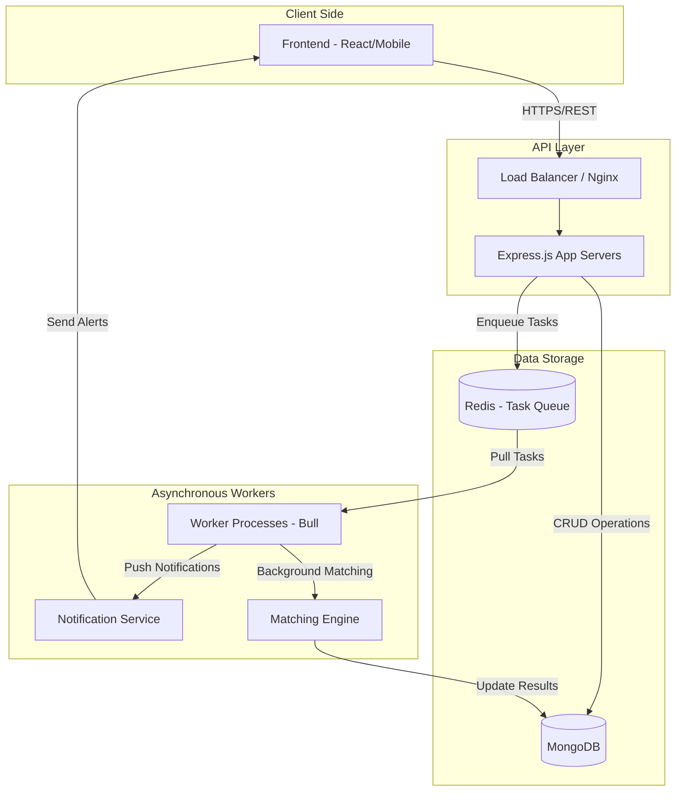
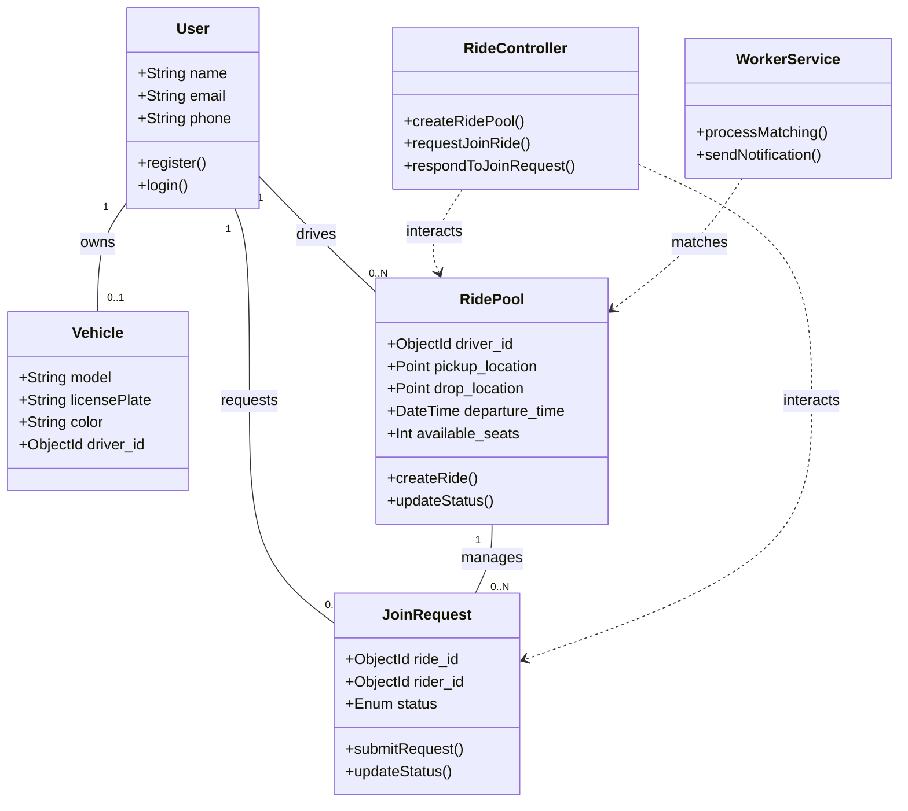
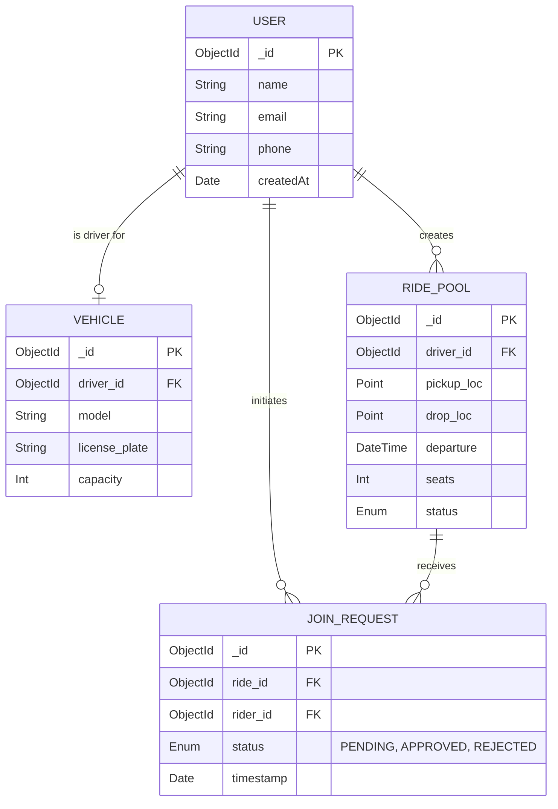

# Carpooling System Design

This document provides a comprehensive overview of the architecture, data flow, and database structure for the Carpooling system.

## High-Level Design (HLD)

This diagram illustrates the data flow from the frontend to the database, incorporating **Redis Workers** for asynchronous processing.

---

## Low-Level Design (LLD) - Class Diagram

The class diagram outlines the relationships between controllers, models, and core services.

---

## Entity-Relationship (ER) Diagram

A relational view of the database schemas and their constraints.

---

## Table Definitions & Idea

| Table (Collection) | Description | Key Fields | Purpose |
| :--- | :--- | :--- | :--- |
| **Users** | User profiles and Auth | `_id`, `email`, `password_hash`, `role` | Core user identity. |
| **Vehicles** | Car details for drivers | `_id`, `driver_id`, `make`, `model`, `plate` | Required for ride posting. |
| **RidePools** | Available ride offers | `_id`, `driver_id`, `pickup_loc`, `drop_loc`, `seats` | Central entity for the app. |
| **JoinRequests** | Pending passenger asks | `_id`, `ride_id`, `rider_id`, `status` | Links riders to pools. |
| **AuditLogs** | System activity tracking | `_id`, `action`, `user_id`, `timestamp` | For debugging and analytics. |

---

## Data Flow Breakdown (Visual Summary)

1.  **Frontend**: User fills out a "Join Ride" form.
2.  **API**: `RideController.requestJoinRide` receives the request.
3.  **Persistence**: A `JoinRequest` is saved to **MongoDB** with status `PENDING`.
4.  **Queue**: Express app pushes a "NotificationTask" to **Redis** (Bull queue).
5.  **Worker**: A background process picks up the task from Redis.
6.  **Action**: Worker sends a push notification to the Driver.
7.  **Finalize**: Once Driver approves, the Worker updates the `available_seats` in `RidePool` and notifies the Rider.
